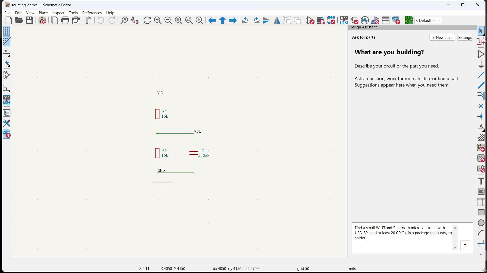
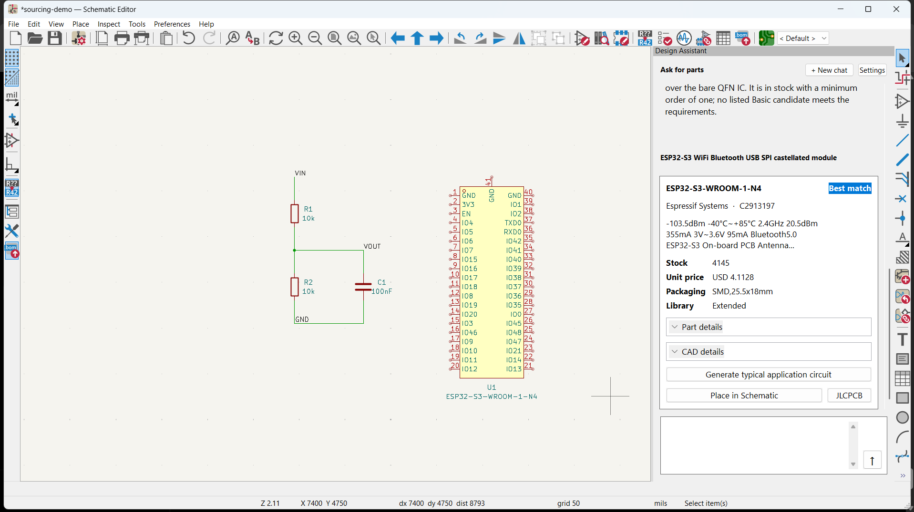
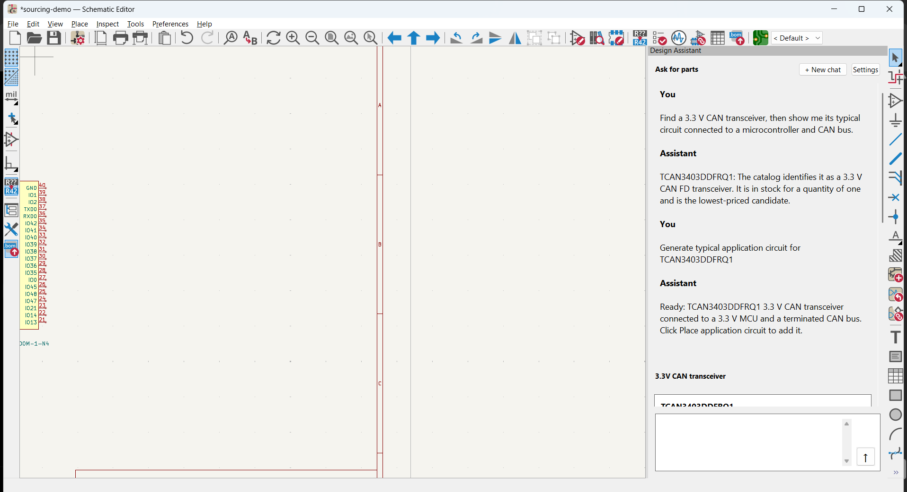
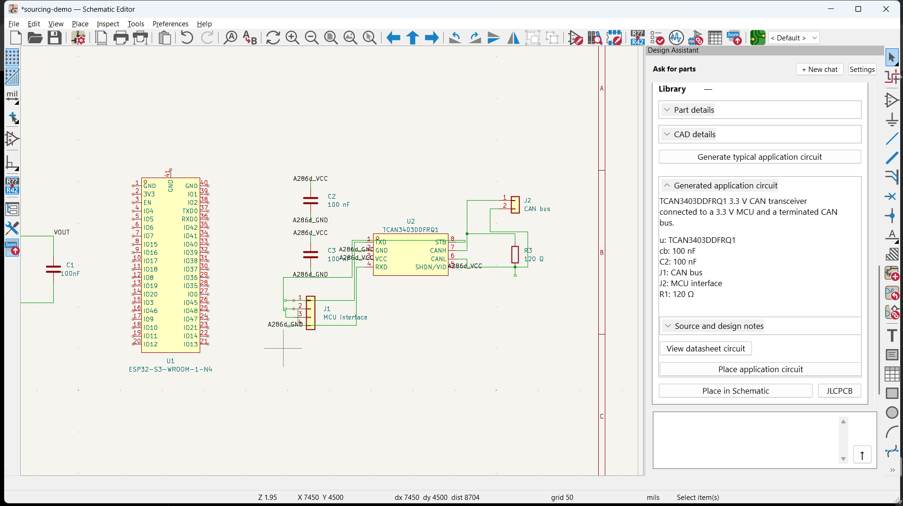
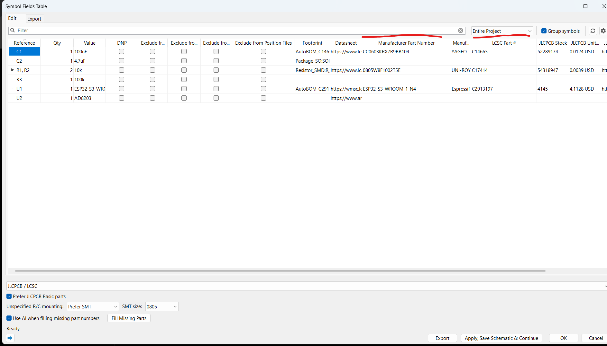
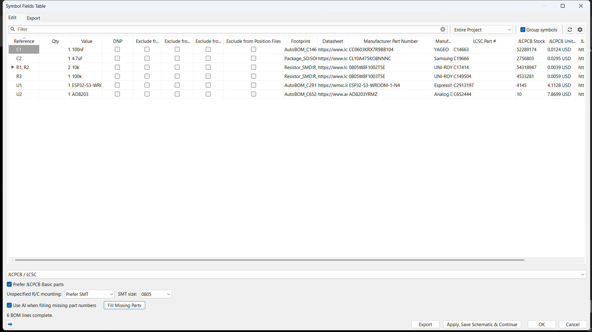

# auto_BOM

**An AI design assistant for finding parts, building circuits, and finishing a KiCad BOM.**

Describe what your design needs, compare available parts, and place a compatible symbol with its sourcing details in KiCad. When a part has a useful, established application circuit, auto_BOM can generate and place the supporting components for you. Then fill missing part numbers across the schematic and get the BOM ready to review and order from your chosen supplier.

auto_BOM runs inside a custom Windows build of KiCad 10.0.6, alongside a local Node.js service.

## See the workflow

Start a conversation in the Design Assistant, then search for a part in plain language. In this demo, the ESP32-S3 search took a few seconds and returned a supplier match with stock, price, package, and CAD details.





If the selected part has a suitable typical circuit, ask the assistant to prepare it. The 3.3 V CAN transceiver circuit shown here was generated in under 10 seconds in this demo. The schematic shows the placed circuit, so you can carry on from there instead of wiring the standard support components by hand.



The assistant keeps the proposed parts list, design notes, and placement controls in the same panel.



When the design is ready, use **Fill Missing Parts** in KiCad's BOM editor. auto_BOM checks the parts against your selected supplier and suggests missing manufacturer and supplier part numbers. Review the changes, then apply the ones you want. The before-and-after example shows six BOM lines completed for ordering.

| Before filling missing parts | After filling missing parts |
| --- | --- |
|  |  |

The search and circuit-generation times are from this demo. They vary with supplier response, AI connection, and whether a circuit recipe is cached.

## Get started

### Try the browser interface

Install a recent Node.js LTS release, then run this in the repository folder:

```powershell
npm install
if (-not (Test-Path .env)) { Copy-Item .env.example .env }
npm start
```

Open [localhost:4173](http://localhost:4173). The browser interface is handy for conversations and part searches. Placing symbols and completing a real schematic BOM require the native KiCad integration.

### Run it in KiCad

Install KiCad 10 and its standard libraries. Prepare the patched source checkout and MSYS2/UCRT64 build dependencies using the [native integration guide](integrations/kicad-native/README.md), then build and launch:

```powershell
& ".\integrations\kicad-native\Build custom KiCad.ps1"
& ".\Start KiCad.ps1"
```

The first build takes time. Later, launch the custom KiCad manager with `Start KiCad.ps1`. In the Schematic Editor, press **Ctrl+Alt+A** to open the Design Assistant. Open **Tools → Generate Bill of Materials...** to fill the BOM. The [sourcing demo](examples/sourcing-demo/README.md) is a good first project.

### Choose your connections

- **JLCPCB / LCSC** is the default parts source and needs no supplier API key. **DigiKey** needs production API credentials in `.env` for live prices and stock.
- For AI, choose a signed-in **Codex account** or an **OpenAI API key** in the assistant settings. API usage is billed separately. The app does not switch providers automatically.
- For EasyEDA symbol and footprint imports, run `& ".\Setup EasyEDA.ps1"` once. For DigiKey CAD imports, connect SnapMagic in assistant settings.

## Before you order

- Supplier stock and prices can change. JLCPCB estimates exclude assembly fees, shipping, and taxes. Check the final supplier listing and assembly preview.
- Search suggestions and generated circuits are drafts for review. Check electrical requirements and imported CAD against the part datasheet before using a design.
- BOM completion preserves existing assignments and leaves unresolved parts visible. Select a supplier and review the final BOM before ordering. The usual KiCad exporter is retained; check its column mapping for your supplier.

## Development

Run offline checks with `npm test`. For opt-in checks against configured live services, run `node scripts/live-sourcing-check.mjs`.

Backend changes need a service restart. Changes to the native KiCad interface require a rebuild. See the [repository guide](docs/REPOSITORY.md), [assistant and circuit-generation details](docs/ASK.md), [native build notes](integrations/kicad-native/README.md), and [test reports](docs/testing/).

The KiCad source patches are distributed under KiCad's GPL terms.
